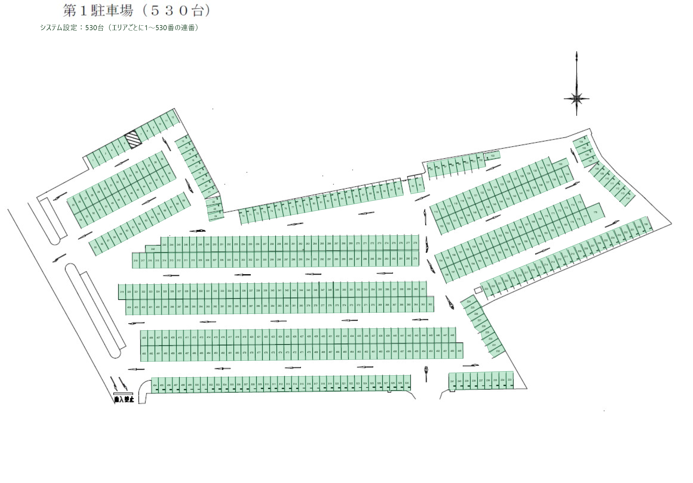

# 第1駐車場の座標設定

`public/images/img1.jpg` の枠線を基に、530枠の初期座標を設定しました。
地図画面と番号一覧は、同じ1〜530番で入出庫します。
番号はこのシステム内で管理するための連番です。現地に書かれた番号との対応は未確認です。
初めて見る人が番号をたどりやすいよう、地図のまとまりごとに番号を付けています。
同じエリア内では番号を連続させ、両面の列は端で折り返します。
前回追加した3枠も隣の列の番号に組み込んでいます。末尾の番号が途中の列へ飛ぶことはありません。



確認画像の緑色はすべての座標を見せるための色です。現在の空き状況を表していません。
実際の地図画面では、空き枠が緑、使用中が赤、自分の枠の外周が黄色になります。

## 保存先

| ファイル | 役割 |
| --- | --- |
| `public/data/parking-spots/lot-1.json` | 地図画面と座標の設定画面が読み込む530枠の座標 |
| `docs/lot-1-map-rows.json` | 元画像上の列や枠線の測定値と、列ごとの番号 |
| `scripts/build-lot1-map.js` | 測定値から座標ファイルを生成する処理 |
| `docs/lot-1-map-preview.png` | 元画像へ座標と番号を重ねた確認画像 |
| `scripts/render-lot1-map-preview.ps1` | 現在の座標ファイルから確認画像を作る処理 |
| `docs/lot-1-renumbering-v4.json` | 532台時点の旧番号と今回の新番号の対応表 |

## エリアごとの番号

| 場所 | 枠番号 | 台数 |
| --- | --- | ---: |
| 左上 | 1〜69 | 69 |
| 上側外周 | 70〜103 | 34 |
| 右上外周 | 104〜114 | 11 |
| 右側上段 | 115〜153 | 39 |
| 右側下段 | 154〜198 | 45 |
| 右側から右下の外周 | 199〜241 | 43 |
| 中央上段 | 242〜318 | 77 |
| 中央中段 | 319〜404 | 86 |
| 中央下段 | 405〜493 | 89 |
| 下側外周 | 494〜530 | 37 |

例えば中央上段は、左の小さな枠が242番、上の列を左から右へ243〜278番、
下の列を右から左へ279〜318番と続きます。
前回の追加枠は、現在の103番・133番・242番です。

## 削除した場所と番号変更

今回削除したのは、532台時点の旧7番（右上外周の最上部）と旧133番（上側の長い列の右寄り）です。
前回削除した右下の角の旧484番のエリアも、引き続き座標には含めていません。
削除対象以外の位置と形は維持しています。

DBの番号変更は `migrations/008-lot1-area-numbering.sql` で一度だけ適用します。
削除する旧7番・旧133番に駐車記録がある場合は、その記録を削除せずに停止します。
残す枠の駐車記録は座標と同じ対応表で新番号へ移すため、駐車位置は維持されます。
現在の7番・133番は別の場所の枠です。番号を振り直した後は1〜530番に欠番はありません。
旧画面から前の番号で入庫する操作は拒否されます。画面を再読み込みしてから利用してください。

画面で使う座標は画像に対する割合です。左上が `[0, 0]`、右下が `[100, 100]` です。
直線で等間隔に並ぶ列は一列を分割し、曲がった部分や幅の異なる枠は枠線ごとに指定しています。
枠線が見えるよう、各座標は枠の中心へ少し寄せています。

## 位置を確認する箇所

左上の斜線部分、入口、通路、通常の枠より細い外周の隙間は座標から除いています。
中央上段の浅い段差部分は利用者の確認に基づき、現在の242番の座標として設定しました。
曲がった部分や端の枠には、線が薄い・境界線が途切れているために推定した位置が含まれます。
現地の測量結果ではありません。特に次の番号は元画像や現地との対応を確認してください。

| 枠番号 | 場所 |
| --- | --- |
| 104〜114 | 右上の外周の折れ曲がり |
| 22〜24 | 左側の外周の曲がった部分 |
| 176 | 右側の島状の列の幅が広い端の枠 |
| 224〜232 | 右下へ曲がる外周の列 |

530枠の位置が正しいかの最終確認は、枠線を重ねた画像と実際の駐車場との対応で行ってください。
台数が合っていても、現地での利用区分や枠番号が一致しているとは限りません。

## 画面で確認・微調整する

1. 駐車場システムを再読み込みし、第1駐車場の「マップから探す」を開きます。
2. 駐車場の部分を押して拡大し、緑の枠と元画像の枠線の位置を確認します。
3. 修正が必要な場合は `http://localhost:3000/coordinate-editor.html` を開き、第1駐車場を選びます。
4. 修正する番号を選び、四隅を外周に沿って指定し直して保存します。
5. 「座標ファイルを保存」でダウンロードし、`public/data/parking-spots/lot-1.json` を置き換えます。
6. 駐車場システムを再読み込みして位置を確認します。

既に登録されている枠の番号を変更すると、駐車記録が別の場所を示す可能性があります。
位置の微調整では番号を維持してください。設定画面はDBの台数や駐車記録を変更しません。
ブラウザに以前の作業途中データが残っている場合は、現在の `lot-1.json` を設定画面へ読み込んでください。

## 測定値から作り直す

```powershell
npm.cmd run build:lot1-map
```

元画像が変わった場合は、古い測定値をそのまま使わないよう生成を停止します。
設定画面などで編集した座標がある場合も、編集内容を保護するため停止します。
測定値へ戻してよい場合に限り `npm.cmd run build:lot1-map -- --replace` で上書きできます。
作り直した後は確認画像の座標と異なる場合があるため、地図画面で位置を確認してください。
確認画像はPowerShellで次のコマンドを実行すると更新できます。

```powershell
powershell.exe -NoProfile -ExecutionPolicy Bypass -File ./scripts/render-lot1-map-preview.ps1
```
